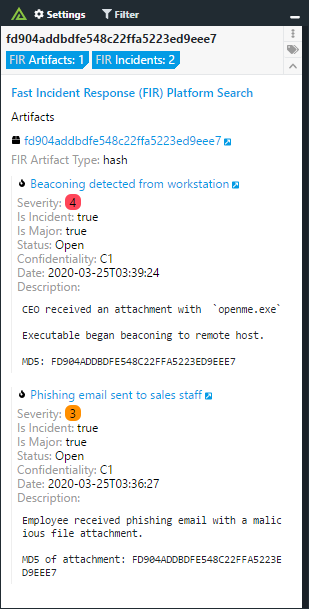

# Polarity FIR (Fast Incident Response) Integration


The FIR (Fast Incident Response) integration searches the FIR cybersecurity incident management platform for artifacts contained within cybersecurity incidents.

To learn more about FIR, please visit the [official website](https://github.com/certsocietegenerale/FIR).

  


## Configuring FIR

For this integration to work, you must enable filtering on the "Artifacts" API Endpoint in FIR.  To do this, you have to modify the "views.py" file contained in /path/to/your/FIR/install/fir_api/views.py

1. Add the following entry to the top of the file in the list of Python module imports:
```
from rest_framework import filters
```

2. Append the following lines to the bottom of the "ArtifactViewSet" class:
```
filter_backends = [filters.SearchFilter]
search_fields = ['value']
```

3. Restart FIR service

## FIR Integration Options

### FIR Server URL

The URL for your FIR instance to include the schema (i.e., https://) and port (e.g., https://fir:8000) as necessary

### FIR REST API Token

A valid REST API Token for your FIR instance.

### Blacklist Indicators

Comma delimited list of indicators you do not want looked up.

### Domain Blacklist Regex

Domains that match the given regex will not be looked up (if blank, no domains will be blacklisted)

### IP Blacklist Regex

IPs that match the given regex will not be looked up (if blank, no IPs will be black listed)

## Installation Instructions

Installation instructions for integrations are provided on the [PolarityIO GitHub Page](https://polarityio.github.io/).

## Polarity

Polarity is a memory-augmentation platform that improves and accelerates analyst decision making. For more information about the Polarity platform please see:

https://polarity.io/
